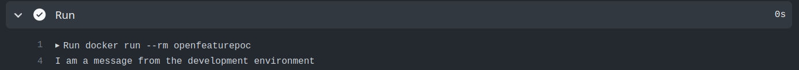
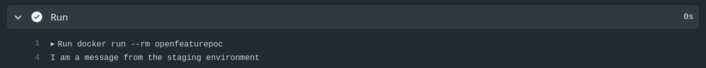
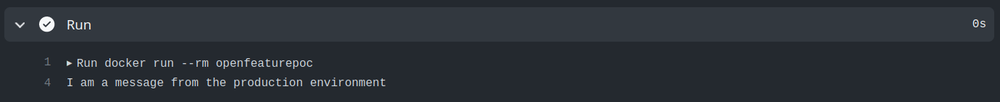

# OpenFeature + Flagd + Github Actions - POC

## Intro

This repo was created as a prof of concept for scenario in which pipelines are run through Github Actions and that uses another repository as source of truth for feature flaging configurations.

## How does it work?

1. The the following `TARGET_ENVIRONMENTS` are considered with the corresponding activation rules on Github Actions workflow:
    a. dev: push to main
    b. staging: any tag with the structure *.*.*-rc.**
    c. production: any tag with the structure *.*.*
2. Another repo contais the `flagd` configuration file: It was done this way because multiple repos can read from the same place, thus providing consistent behaviour. In order to copy this repo in the pipeline deploy keys were used. The public key was registred in [this other repo](https://github.com/luizgribeiro/flagd-template-ghActions-POC) and the private key was set as a secret at the current repo.
3. The flagd configuration file was made so that the available keys matched `TARGET_ENVIRONMENTS` values
4. The `defaultVariant` of the feature flag was set using envsubst with the current value os `TARGET_ENVIRONMENT`
5. A container image (deployable artefact) was build with flagd + configuration file and application: the application comunicates with flagd through unix sockets in order to evaluate the requested flag

## Results

### `TARGET_ENVIRONMENT`: dev

### `TARGET_ENVIRONMENT`: staging

### `TARGET_ENVIRONMENT`: production

